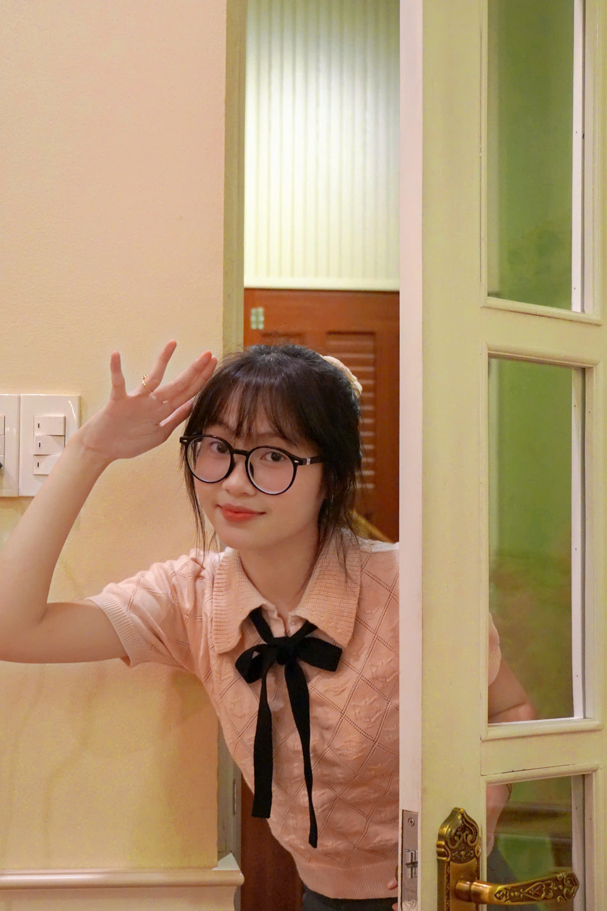
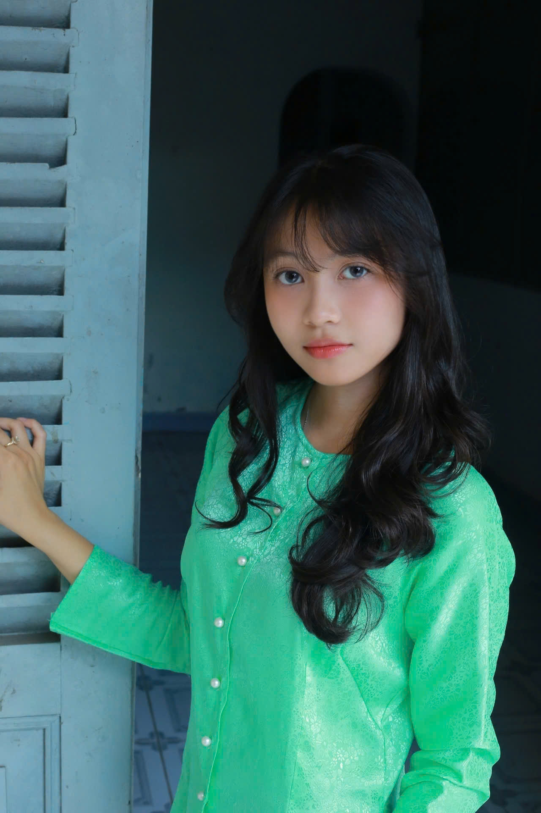

<html lang="vi">
<head>
  <meta charset="UTF-8">
  <meta name="viewport" content="width=device-width, initial-scale=1.0">
  <title>Trang Web Của Tôi</title>
  
</head>
<body>
  

    <h1 class="floating-text">NGUYỄN HỒNG NGỌC XIN CHÀO</h1>
  

</body>

<html lang="vi">
<head>
  <meta charset="UTF-8">
  <meta name="viewport" content="width=device-width, initial-scale=1.0">
  <title>Trang Web Của Tôi</title>
  <link href="https://fonts.googleapis.com/css2?family=Lora&display=swap" rel="stylesheet"> <!-- Thêm link font Lora -->
  
</head>
<body>

  

    <!-- Dòng giới thiệu khái quát bản thân -->
    

      Xin chào, mình là Hồng Ngọc. Đây là trang web cá nhân của mình, nơi mình chia sẻ một chút về bản thân và những điều mình yêu thích.
    

    <!-- Nội dung chính đầu tiên -->
    

      

        
        
        
        
      

      

        
Sở Thích Của Tôi

        
Xin chào các bạn, mình tên là Hồng Ngọc. Sở thích của mình là xem phim, nghe nhạc và ngủ

      

    

    <!-- Nội dung chính thứ 2 -->
    

      

        
Những Điều Tôi Thích Làm

        
Chữ bên trái, ảnh bên phải

      

      

        
        
        
        
      

    

<h2>Profile các bạn nhóm 5</h2>
<ul>
<li> Xin chào các bạn, mình tên là Hồng Ngọc. Sở thích của mình là xem phim, nghe nhạc và ngủ
<image src="z6098482597170_f4cf723791d4f9219190285715e5820a.jpg">
<li> Thông tin cá nhân
    <ol>
    <li>Họ và tên: Nguyễn Hồng Ngọc</li>
    <li>Trường trung học phổ thông Chuyên Bến Tre</li>
    <li>Lớp: 12 Lý</li>
    <li>Giới tính: Nữ</li> 
    <li>Cân nặng: 41kg</li>
    <li>Chiều cao: 1,54m</li>
    </ol>
</li>
<li> Nguyện vọng tương lai 
    <ol>
    <li>Khối thi là Khoa học tự nhiên </li>
    <li>Nguyện vọng 1 là Đại học Ngoại Thương</li>
    </ol>
</li>
